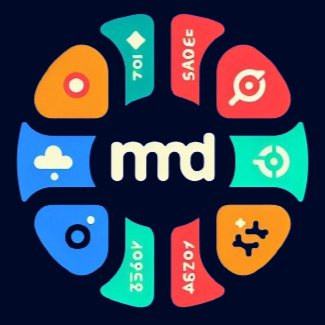
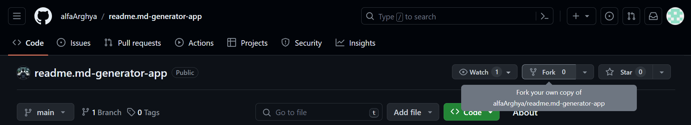

<p align="center">

<h1 align="center"> README.md Generator </h1>
</p>

<div align="center">


</div>

<div align="center">

</div>

### Tech Used 💻


#

### Wanna Contribute 🤔??

- #### 🍴 Create a Fork of this repo to your GitHub Account

  

- #### 🧑🏽‍💻 Clone the Your Repo Locally

  first open your CLI and clone the repo locally. But don't forget put your github username in _username_

  ```bash
  git clone https://github.com/username/readme.md-generator-app.git
  ```

- #### 👋🏽 Go to the project folder

  ```bash
  cd readme.md-generator-app
  ```

- #### 🚀 Install Require modules

  ```bash
  npm install
  ```

- #### 🏃🏽‍♂️Run Project Locally

  ```bash
  npm run dev
  ```

- #### 💡 Make Changes & Pull Requests

  Make changes as require and push it to your GitHub with proper **commit message**. From their Create a **PR(Pull Request)** and submit it.

- #### 📌 Additional Tip
  Try to make a new branch relevant to your work. It's not Necessary for contribution but it will help me to marge it.

#

### License 🪪

[GPT-3.0](LICENSE)

#

### Author ✍🏽

#### [Arghya Das](https://github.com/alfaArghya)

#

### Join Here to Discuss 🗣️

[](https://discord.gg/JHhjXCVJmq)

#

### Connect Here 🌐

[](https://linkedin.com/in/alfaarghya)
